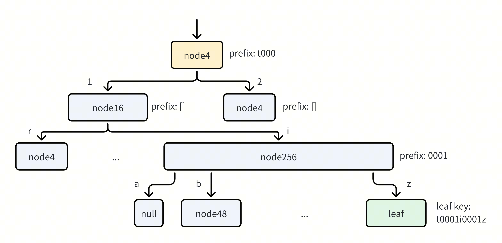
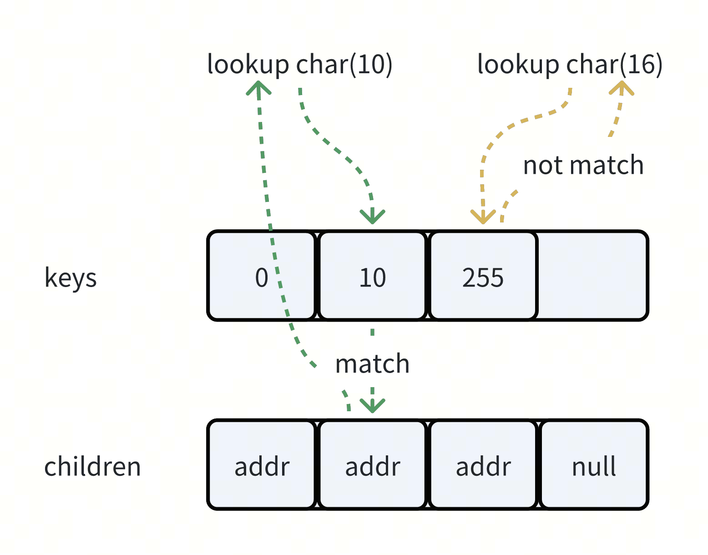
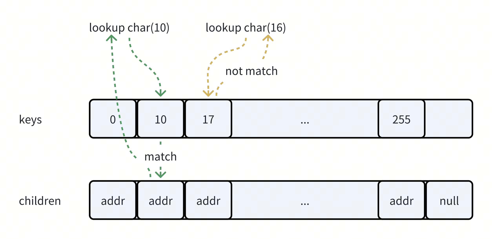
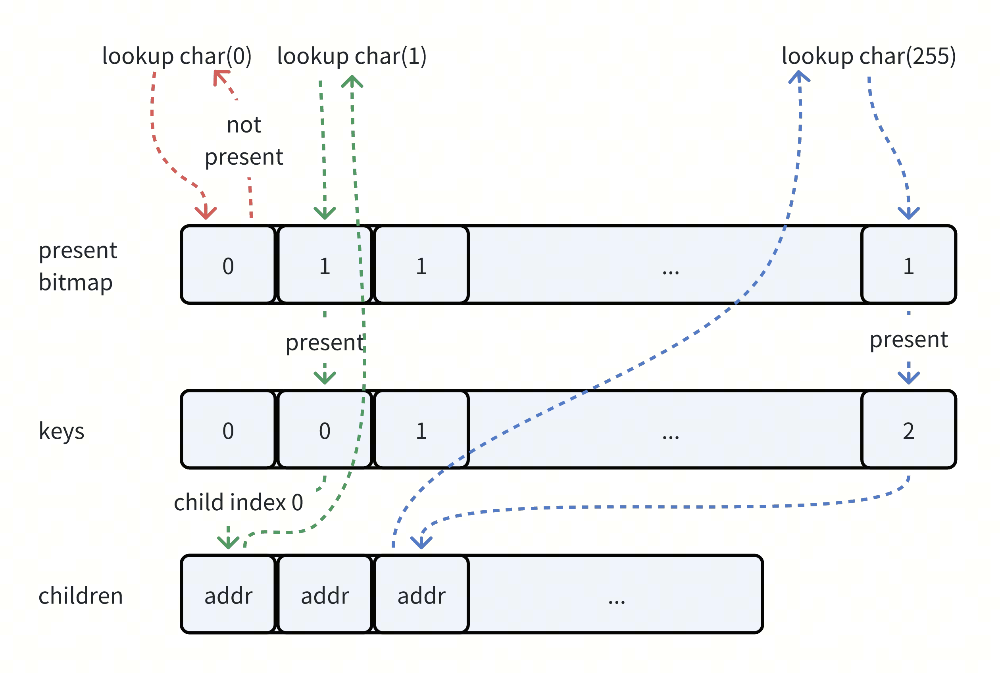
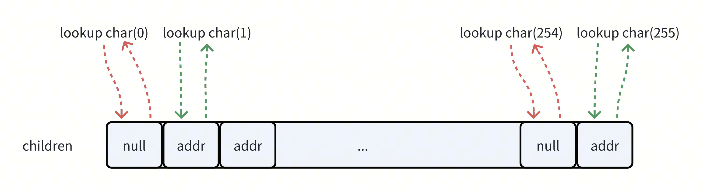
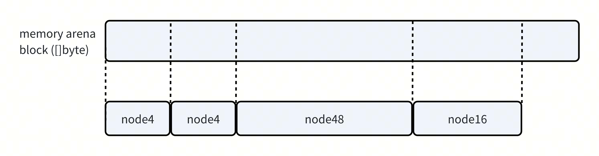

# Design of ART

## Background

The membuffer stores the temporary data of transaction, which is an in-mem index module with rich features.

- Set/Get
- Iterate
- Staging/Release/Cleanup
- Snapshot Get/Iterate
- Memory Tracking

[ART][ART_Paper] is an in-mem index data structure, with performance surpasses search trees, as well as surpress the memory space amplification issue of radix tree. It's a fitting solution for TiDB's usage in our test.

## Design

### Index

The index implementation follows the paper, which has 4 types of node.

#### Lookup

The node of tree always tracks the longest common prefix of all children nodes or leaves, in the above figure, the depth of leaf `t0001i0001z` is 4, which means we need lookup 4 times when searching it.

#### Set

The insert case is much more complex, we may meet one of the following cases:

- `set(t000, ...)` will be written an inplace leaf of the yellow node4, the node4 can still have other 4 children.
- `set(t0003, ...)` will create a new leaf node under the yellow node4, if the node4 already have 4 children, it will grow to node16.
- `set(t0001i0001z0001, ...)` will replace the green leaf with a new created node4, the green leaf and the new inserted leaf will be inplace leaf or children of the new created node4.

### Node

If a node4 is full and it's grown to node16, the old node4 can be put into a recycle list, we will reuse it when a new allocation of node4 reached, so the size of every node is fixed.

Each node has an embeded base node, which contains the children number, prefix length, prefix array and an inplace leaf address.

The lookup process of each node is showed in below figures.

#### Node4 lookup

The keys slice stores the indexed char in ordered, so it just simply iterates the keys array when searching. If the key is matched, return the child with same index.

#### Node16 lookup

The node16 is almost same as node4, but we performs lookup with a binary search.

#### Node48 lookup

#### Node256 lookup

### Memory Arena

In GC language, every allocated memory piece is tracked by runtime, to optimize high frequency small writes, we need a memory arena to reduce the number of allocation.

The figure shows how the memory arena works. The arena allocates a long buffer each time, and cast it to the type we need.

The side effect of memory arena is the pointer should be replaced with arena's address. And the dereference need to involve memory arena, which makes the code much more complex.

### Value Log

[ART_Paper]: https://db.in.tum.de/~leis/papers/ART.pdf
